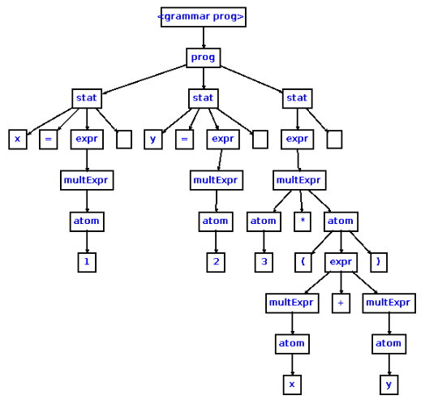

# EGG

Creando nuestro propio lenguaje de programación usando JS.

[toc]

## P5-t1-egg-0

Nuestro primer objetivo debe ser leer el capítulo 12 de 'Eloquent JS': [A Programming Language](https://eloquentjavascript.net/12_language.html). 

En este se nos presenta el desarrollo, procesado e interpolación de un lenguaje llamado Egg. Una vez tengamos las bases de nuestro lenguaje, iremos expandiendolo en las siguientes prácticas añadiendole nuevas capacidades: Expresiones regulares, hashes, arrays multidimensionales, módulos, objetos, clases...

### Eloquent JS: A Programming Language

Debemos leer cuidadosamente el capítulo "[A Programming Language]( https://eloquentjavascript.net/12_language.html)" tratando de comprender como funcionan las fases de analisis sintáctico que produce el AST y la fase de ejecución de dicho AST.

***

`parseExpression(program)` se encargará de transformar nuestro porgrama en un AST.

`parseApply(expr, program)` se encargará de concantenar las funciones con sus valores hijos en el AST.

`parse(program)` se limitará a verificar si el programa ha sido completamente parseado, y devolverá la estructura del AST.

***

`evaluate(expr, scope)` se encargará de ejecutar nuestro AST.

***

`run(program)` recibirá una cadena de texto como entrada, la cual parseará y posteriormente ejecutará.

***

**Funciones básicas de nuestro lenguaje egg**

`[op](value, value)`

`if(bool, value (true), value (false))`

`while(bool, program)`

`do(...args)`

`define(word, value)`

`print(value)`

`fun(...word, program)`

***

### Gramática

```
expression: STRING
          | NUMBER
          | WORD apply

apply: /* vacio */
     | LP (expression COMMA)* expression? RP apply
```

**Tokens:**

```
WHITES = /^(\s|#.*)*/
STRING = /^"([^"]*)"/
NUMBER = /^\d+\b/
WORD   = /^[^\s(),"]+/
LP     = /(/
RP     = /)/
```

### Árboles de Análisis Abstractos (AST)

Porta la misma info que un arbol de análisis sintáctico pero de forma más condensada, eliminandose terminales y producciones que no aportan información.


Para un arbol sintáctico concreto:



Este podría ser un arbol sintáctico abstracto con la misma información:


### Comentarios

Nuestro lenguaje egg no puede lidiar con comentarios con tan solo la función `skipSpace(string)`. Modificar nuestro código para que pueda hacerlo, por ejemplo, modificando u añadiendo una nueva expresión regular que case con comentarios, como:

```regexp
/^(\s|[#;].*|\/\*(.|\n)*?\*\/)*/
```

### Mejorando rango de declaraciones

Nuestro lenguaje egg no puede modificar una variable global si no estamos situados en el scope global, pues acabaremos creando en su lugar una variable local con su mismo nombre y el nuevo valor si tratamos de usar `define`. Tendremos que modificar el lenguaje añadiendo una forma especial `set(word, value)` que asigne a las variables un nuevo valor, modificando el valor del entorno superior si no existe en el actual. (Deberemos lanzar un error si dicha variable no existe).


### Separando el Analizado Léxico y el Analizador Sintáctico

Ahora separaramos la fase de análisis léxico y de análisis sintáctico.

La funcion `lex()` se encargará del análisis léxico, y cada vez que detecte un token, lo devolverá a la rutina de análisis sintáctico `parseExpression()`. 

Se usará una variable compartida llamada `lookahead` para guardar el token actual a la hora de que el analisis léxico y sintáctico deban cominicarse. 

### Módulos

- `lib` contiene:

`parse.js`, que contiene todas las funciones del análisis léxico y sintáctico.

`eggvm.js`, que contiene todo el código relativo al entorno de ejecución. Contiene funciones para leer y ejecutar el AST creado en la primera fase.

- `bin` contiene:

`egg.js` ejecuta un programa .egg.

`eggc` compila el programa produciendo un arbol JSON en un fichero .evm contieniendo el AST.

`evm` ejecuta los ficheros en formato .evm.

- `examples` contiene:

Una serie de ejemplos de programas .egg para comprabar el correcto funcionamiento del módulo.

- `test` contiene los tests de la práctica.

***

### Retos práctica 1

- [x] Aceptar corchetes del estilo `()[]{}`.

- [ ] Incluir nuevos tests.

***


